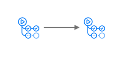

# Actions Sync

<p align="center">
  
</p>

This is a standalone Go tool to allow you to sync from [GitHub](https://www.github.com) to a [GitHub Enterprise instance](https://github.com/enterprise). GitHub Enterprise is referred to as `GHES` throughout this document.

* Current status: **ready for production use**
* Download from: [releases page](https://github.com/actions/actions-sync/releases/)
* Build status: 

It is designed to work when:
* The GitHub Enterprise instance is separate from the rest of the internet.
* The GitHub Enterprise instance is connected to the rest of the internet.

### Note

Thank you for your interest in this GitHub action, however, right now we are not taking contributions.

We continue to focus our resources on strategic areas that help our customers be successful while making developers' lives easier. While GitHub Actions remains a key part of this vision, we are allocating resources towards other areas of Actions and are not taking contributions to this repository at this time. The GitHub public roadmap is the best place to follow along for any updates on features we’re working on and what stage they’re in.

We are taking the following steps to better direct requests related to GitHub Actions, including:

1. We will be directing questions and support requests to our [Community Discussions area](https://github.com/orgs/community/discussions/categories/actions)

2. High Priority bugs can be reported through Community Discussions or you can report these to our support team https://support.github.com/contact/bug-report.

3. Security Issues should be handled as per our [security.md](security.md)

We will still provide security updates for this project and fix major breaking changes during this time.

You are welcome to still raise bugs in this repo.

## Connected instances

When there are machines which have access to both the public internet and the GHES instance run `actions-sync sync`.

**Command:**

`actions-sync sync`

**Arguments:**

- `cache-dir` _(required)_
   The directory in which to cache repositories as they are synced. This speeds up re-syncing.
- `destination-url` _(required)_
   The URL of the GHES instance to sync repositories onto.
- `destination-token` _(required)_
   A personal access token to authenticate against the GHES instance when uploading repositories. See [Destination token scopes](#destination-token-scopes) below.
- `repo-name` _(optional)_
   A single repository to be synced. In the format of `owner/repo`. Optionally if you wish the repository to be named different on your GHES instance you can provide an alias in the format: `upstream_owner/upstream_repo:destination_owner/destination_repo`
- `repo-name-list` _(optional)_
   A comma-separated list of repositories to be synced. Each entry follows the format of `repo-name`.
- `repo-name-list-file` _(optional)_
   A path to a file containing a newline separated list of repositories to be synced. Each entry follows the format of `repo-name`.
- `actions-admin-user` _(optional)_
   The name of the Actions admin user, which will be used for updating the chosen action. To use the default user, pass `actions-admin`. If not set, the impersonation is disabled. Note that `site_admin` scope is required in the token for the impersonation to work.

**Example Usage:**

```
  actions-sync sync \
    --cache-dir "/tmp/cache" \
    --destination-token "token" \
    --destination-url "https://www.example.com" \
    --repo-name actions/setup-node
```

## Not connected instances

When no machine has access to both the public internet and the GHES instance:

1. `actions-sync pull` on a machine with public internet access
2. copy the provided `cache-dir` to a machine with access to the GHES instance
3. run `actions-sync push` on the machine with access to the GHES instance

**Command:**

`actions-sync pull`

**Arguments:**

- `cache-dir` _(required)_
   The directory to cache the pulled repositories into.
- `repo-name` _(optional)_
   A single repository to be synced. In the format of `owner/repo`. Optionally if you wish the repository to be named different on your GHES instance you can provide an alias in the format: `upstream_owner/upstream_repo:destination_owner/destination_repo`
- `repo-name-list` _(optional)_
   A comma-separated list of repositories to be synced. Each entry follows the format of `repo-name`.
- `repo-name-list-file` _(optional)_
   A path to a file containing a newline separated list of repositories to be synced. Each entry follows the format of `repo-name`.

**Example Usage:**

```
  bin/actions-sync pull \
    --cache-dir "/tmp/cache" \
    --repo-name actions/setup-node
```

**Command:**

`actions-sync push`

**Arguments:**

- `cache-dir` _(required)_
   The directory containing the repositories fetched using the `pull` command.
- `destination-url` _(required)_
   The URL of the GHES instance to sync repositories onto.
- `destination-token` _(required)_
   A personal access token to authenticate against the GHES instance when uploading repositories. See [Destination token scopes](#destination-token-scopes) below.
- `repo-name`, `repo-name-list` or `repo-name-list-file` _(optional)_
   Limit push to specific repositories in the cache directory.
- `actions-admin-user` _(optional)_
   The name of the Actions admin user, which will be used for updating the chosen action. To use the default user, pass `actions-admin`. If not set, the impersonation is disabled. Note that `site_admin` scope is required in the token for the impersonation to work.

**Example Usage:**

```
  bin/actions-sync push \
    --cache-dir "/tmp/cache" \
    --destination-token "token" \
    --destination-url "https://www.example.com"
```

## Destination token scopes

When creating a personal access token include the `repo` and `workflow` scopes. Include the `site_admin` scope (optional) if you want organizations to be created as necessary or you want to use the impersonation logic for the `push` or `sync` commands.

